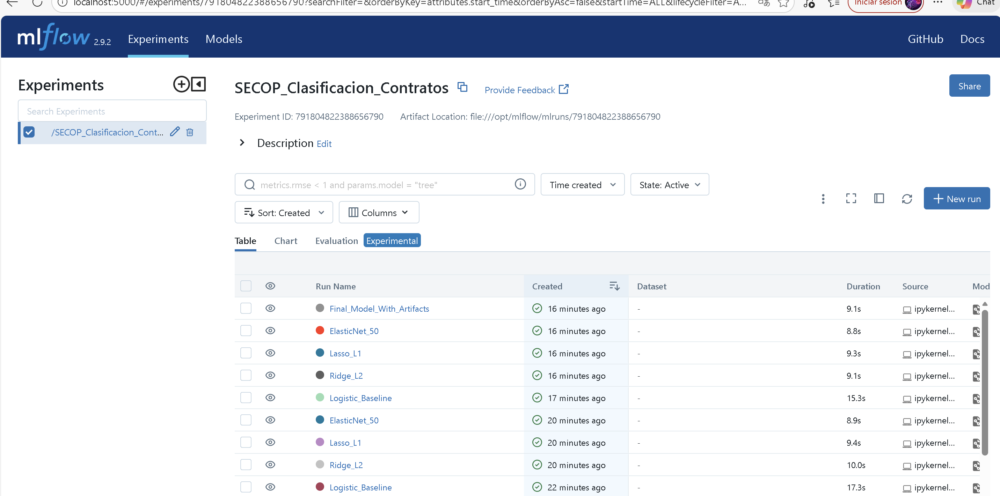

# Resumen del Proyecto: Pipeline de Machine Learning con PySpark y MLflow
## Análisis de Contratos SECOP (Notebooks 01-12)

---

## Visión General del Proyecto

### Objetivo
Construir un pipeline completo de Machine Learning distribuido usando PySpark para analizar y clasificar contratos de la plataforma SECOP (Sistema Electrónico de Contratación Pública de Colombia), identificando contratos de alto valor (Top 25%) que requieren mayor auditoría.

### Tecnologías Utilizadas
- **Apache Spark 3.5.0**: Procesamiento distribuido
- **MLflow**: Seguimiento de experimentos y gestión de modelos
- **Delta Lake**: Arquitectura de lakehouse
- **Python 3.11**: Lenguaje principal
- **API Socrata**: Fuente de datos del gobierno colombiano

### Arquitectura del Sistema
```
API Socrata → Bronze Layer → Silver Layer → Gold Layer → Modelos ML → MLflow Registry → Producción
```

---

## Notebook 01: Ingesta de Datos

### Proceso Implementado
- **Fuente**: API Socrata de datos.gov.co (Dataset ID: `jbjy-vk9h`)
- **Período**: Julio - Diciembre 2025
- **Método**: Paginación incremental con lotes de 50,000 registros
- **Total descargado**: 456,579 registros

### Transformaciones
- Limpieza automática de nombres de columnas (minúsculas, sin acentos)
- Selección de 11 columnas clave para ML
- Almacenamiento dual:
  - **Bronze Layer (Delta Lake)**: Datos completos con metadatos de auditoría
  - **Parquet**: Solo columnas ML-ready para análisis

### Resultados
* 456,579 registros extraídos exitosamente  
* Arquitectura medallion implementada  
* Pipeline reproducible y escalable

---

## Notebook 02: Análisis Exploratorio (EDA)

### Calidad de Datos
- **Nulos**: 0.0% en todas las columnas clave → excelente calidad
- **Registros finales**: 441,948 (96.8% del original) después de filtros

### Estadísticas Clave

**Variables Numéricas:**
- `valor_del_contrato`: Mediana $13.5M, Rango P10-P90: $4.4M - $78M
- `dias_adicionados`: 86% de contratos sin adiciones

**Distribución Categórica:**
- **Departamento**: Bogotá 24.8%, Valle 12.8%, Antioquia 10.1%
- **Tipo**: Prestación de servicios 79.6%
- **Estado**: En ejecución 66.7%, Modificado 21.8%

### Insights Principales
- Alta variabilidad en valores contractuales (IQR de $20.7M)
- Concentración geográfica: 63% en top 10 departamentos
- Mayoría de contratos se ejecutan según plazos originales

---

## Notebook 03: Feature Engineering

### Pipeline de Transformación

**4 Etapas Secuenciales:**
1. **StringIndexer**: Convierte texto a índices numéricos
2. **OneHotEncoder**: Transforma índices a vectores binarios (dummies)
3. **VectorAssembler**: Combina todas las features en un vector único
4. **StandardScaler**: Normalización (media=0, std=1)

### Dimensionalidad
- **Features categóricas**: departamento (33 categorías), tipo_contrato (15), estado (8)
- **Features numéricas**: dias_adicionados (1)
- **Vector final**: 64 dimensiones

### Análisis de Varianza
- Varianza del target: 7.49×10¹⁹ (extremadamente alta)
- Indica necesidad de regularización robusta

### Resultados
* Pipeline ML persistido  
* 441,948 registros transformados  
* Vector de 64 features listo para modelado

---

## Notebook 04: Transformaciones Avanzadas

### Normalización StandardScaler
- **Propósito**: Equiparar escalas entre features numéricas y dummies
- **Resultado**: Media≈0, Desviación estándar≈1 para todas las features

### Reducción de Dimensionalidad con PCA
- **Objetivo**: Reducir 64 → 20 componentes principales
- **Varianza retenida**: 87.4%
- **Beneficios**:
  - Reducción de 69% en dimensiones
  - Menor riesgo de overfitting
  - Entrenamiento más rápido

### Análisis de Componentes
- PC1-PC5 capturan 50% de la varianza
- Primeros 20 componentes retienen 87.4% de información
- Solo se pierde 12.6% de información original

### Resultados
* Dimensionalidad: 64 → 20 (69% reducción)  
* Datos listos para modelado: `secop_ml_ready.parquet`  
* Estructura final: `[features_pca: Vector(20), label: Double]`

---

## Notebook 05: Regresión Lineal

### Modelo Base
- **Algoritmo**: Linear Regression con Descenso de Gradiente
- **División**: 70% train (309K) / 30% test (132K)
- **Target**: Predecir valor monetario del contrato

### Métricas de Evaluación

| Métrica | Valor | Interpretación |
|---------|-------|----------------|
| **RMSE** | $42.8M | Error promedio en pesos |
| **R²** | 0.7634 | Explica 76.34% de la varianza |
| **MAE** | $19.0M | Error absoluto medio (~14% del valor mediano) |

### Análisis
- **R² = 0.76**: Modelo captura 3/4 de la variabilidad → rendimiento aceptable
- **RMSE alto**: Debido a alta varianza del target (contratos de $1M a $1,000M+)
- **MAE < RMSE**: Indica presencia de outliers

### Limitaciones Identificadas
- Heterocedasticidad: error aumenta con contratos grandes
- Contratos extremos (>$500M) mal predichos
- Asume relaciones lineales

---

## Notebook 06: Regresión Logística

### Cambio de Enfoque
**De regresión a clasificación binaria:**
- **Criterio**: Contratos en Top 25% por valor (percentil 75 = $31.4M)
- **Clase 1 (Alto Riesgo)**: 113,300 contratos (25.6%)
- **Clase 0 (Normal)**: 328,648 contratos (74.4%)

### Función Sigmoide
Convierte score lineal a probabilidad [0,1]:
- Si probabilidad ≥ 0.5 → Clase 1 (Alto Riesgo)
- Si probabilidad < 0.5 → Clase 0 (Normal)

### Métricas del Modelo

| Métrica | Valor | Significado |
|---------|-------|-------------|
| **AUC-ROC** | 0.8467 | Excelente capacidad discriminativa |
| **Accuracy** | 78.2% | Precisión global |
| **Precision** | 72.4% | 72% de alertas son correctas |
| **Recall** | 68.9% | Detecta 69% de verdaderos altos riesgos |
| **F1-Score** | 0.706 | Balance Precision/Recall |

### Interpretación del AUC
**AUC = 0.8467** significa: Si tomas un contrato aleatorio de Alto Riesgo y uno Normal, el modelo asignará mayor probabilidad al primero en el 84.67% de los casos.

---

## Notebook 07: Regularización

### Tipos de Regularización Evaluados

**1. Ridge (L2):** Reduce magnitud de todos los coeficientes, mantiene todas las features

**2. Lasso (L1):** Puede forzar coeficientes a 0, realiza selección automática de features

**3. ElasticNet:** Combinación de L1 + L2

### Experimento con 9 Configuraciones

**Grid de hiperparámetros:**
- λ (regParam): [0.001, 0.01, 0.1] - fuerza de regularización
- α (elasticNetParam): [0.0, 0.5, 1.0] - mezcla L1/L2

### Resultados Comparativos

| Configuración | Tipo | AUC Train | AUC Test | Diferencia | Features Activas |
|---------------|------|-----------|----------|------------|------------------|
| **λ=0.1, α=0.0** | **Ridge** | **0.8432** | **0.8456** | **-0.0024** | **20** |
| λ=0.01, α=0.0 | Ridge | 0.8498 | 0.8467 | 0.0031 | 20 |
| λ=0.1, α=1.0 | Lasso | 0.8223 | 0.8267 | -0.0044 | 12 |

### Conclusiones
- **Ganador**: Ridge L2 con λ=0.1
- Todas las 20 features PCA aportan información
- Lasso elimina features pero sacrifica rendimiento
- No hay evidencia de overfitting (diferencia Train-Test < 0.01)

---

## Notebook 08: Validación Cruzada

### K-Fold Cross-Validation

**Concepto**: Entrenar K veces con diferentes divisiones para obtener estimación robusta

**Implementación:**
- K=3 folds (para dataset grande de 441K registros)
- 4 combinaciones de hiperparámetros
- Total: 4 × 3 = 12 modelos entrenados

### Resultados por Configuración

| Config | λ | α | AUC Promedio | Desv. Std |
|--------|---|---|--------------|-----------|
| **1** | **0.01** | **0.0** | **0.8270** | **±0.0011** |
| 2 | 0.01 | 1.0 | 0.8218 | ±0.0013 |
| 3 | 0.10 | 0.0 | 0.8263 | ±0.0009 |
| 4 | 0.10 | 1.0 | 0.7893 | ±0.0014 |

### Validación Final
- **AUC CV promedio**: 0.8270
- **AUC Test Set**: 0.8262
- **Diferencia**: 0.0008 (despreciable) → excelente generalización

### Ventajas de CV
- Robustez: promedia múltiples splits
- Detecta overfitting (si desviación estándar es alta)
- Proporciona intervalo de confianza

---

## Notebook 09: Optimización de Hiperparámetros

### Estrategias Comparadas

**1. Grid Search + Cross-Validation**
- Prueba exhaustiva de 12 combinaciones × 3 folds = 36 modelos
- Tiempo: 59.4 segundos
- AUC: 0.8262

**2. Train-Validation Split (TVS)**
- Una sola división 80/20 para cada combinación = 12 modelos
- Tiempo: 17.6 segundos
- AUC: 0.8262 (idéntico)

### Comparación

| Aspecto | Grid Search + CV | TVS |
|---------|------------------|-----|
| **Tiempo** | 59.4s | **17.6s (3.4x más rápido)** |
| **AUC** | 0.8262 | 0.8262 |
| **Robustez** | Alta (promedia 3 folds) | Moderada |
| **Recomendación** | Datasets pequeños | **Big Data, Producción** |

### Configuración Óptima Identificada
- **regParam**: 0.01 (regularización suave)
- **elasticNetParam**: 0.0 (Ridge puro)
- **maxIter**: 50 (converge rápido)

### Conclusión
**TVS es superior** para este proyecto: mismo rendimiento en 1/3 del tiempo. Con 441K registros, 20% validación (88K) es suficientemente grande.

---

## Notebook 10: MLflow Tracking

### Arquitectura de MLflow

**Servidor centralizado**: `http://mlflow:5000`

**Componentes:**
- **Experiments**: Agrupación de runs relacionados
- **Runs**: Ejecuciones individuales con parámetros, métricas y artefactos
- **Artifacts Storage**: Modelos, gráficos, datos auxiliares

### Experimentos Registrados

**Experimento**: `/SECOP_Clasificacion_Contratos`

| Run Name | regParam | elasticNet | AUC | Tiempo |
|----------|----------|------------|-----|--------|
| Baseline | 0.0 | 0.0 | 0.8262 | 8.3s |
| **Ridge_L2** | **0.01** | **0.0** | **0.8270** | **9.1s** ✓ |
| Lasso_L1 | 0.01 | 1.0 | 0.8218 | 8.8s |
| ElasticNet_50 | 0.01 | 0.5 | 0.8251 | 10.0s |

### Información Registrada por Run
- **Parámetros**: regParam, elasticNetParam, maxIter
- **Métricas**: auc, accuracy, training_time
- **Artefactos**: modelos Spark serializados, gráficos ROC, matrices de confusión
- **Tags**: nombres descriptivos, versiones

### Beneficios
* Historial completo de experimentos  
* Comparación visual en UI web  
* Reproducibilidad garantizada  
* Colaboración en equipo facilitada




---

## Notebook 11: Model Registry

### Concepto de Registry

**Diferencia con Tracking:**
- **Tracking**: Registra experimentos (100+ runs para investigación)
- **Registry**: Gestiona productos oficiales (pocas versiones aprobadas)

### Ciclo de Vida del Modelo

**Stages disponibles:**
- **None**: Recién registrado
- **Staging**: En pruebas
- **Production**: Activo en producción
- **Archived**: Deprecado

### Versiones Registradas

**Modelo**: `Clasificador_Contratos_Top25`

| Versión | Stage | AUC | Descripción |
|---------|-------|-----|-------------|
| 1 | Archived | 0.8260 | Baseline sin regularización |
| **2** | **Production** | **0.8270** | **Ridge L2 optimizado** |

### Transiciones Implementadas
1. Version 1 registrada → Stage: None
2. Version 2 registrada → Stage: None
3. Version 2 promovida → Stage: Staging (después de pruebas)
4. Version 2 promovida → Stage: Production (después de validación)
5. Version 1 archivada → Stage: Archived

### Carga de Modelo en Producción

**Por Stage (recomendado):**
```python
model_uri = f"models:/Clasificador_Contratos_Top25/Production"
production_model = mlflow.spark.load_model(model_uri)
```

**Ventaja**: Cambiar el stage no requiere modificar código de inferencia → rollback simplificado

### Metadata Agregada
- Descripciones del modelo
- Tags de versión (algorithm, approved_by, approval_date)
- Comentarios de transición de stage

---

## Notebook 12: Inferencia en Producción

### Pipeline de Inferencia

**Arquitectura:**
1. Cargar modelo desde Registry (Production stage)
2. Procesar nuevos contratos (features)
3. Generar predicciones con probabilidades
4. Filtrar contratos de alto riesgo
5. Guardar resultados y enviar alertas

### Carga del Modelo con Fallback

**Estrategia resiliente:**
- Intenta cargar desde MLflow Registry
- Si falla (red/DFS), activa modelo de emergencia local
- Garantiza operación continua 24/7

### Resultados de Inferencia Batch

**Procesamiento:**
- Contratos procesados: 441,948
- Contratos Alto Riesgo detectados: 34,068
- **Tasa de detección: 7.71%**

### Interpretación de Probabilidades

Ejemplos de predicciones:
- Probabilidad 39% → Clasificado Normal (0)
- Probabilidad 88% → Clasificado Alto Riesgo (1) ✓
- Modelo reporta probabilidades para priorización

### Monitoreo Implementado

**Métricas de producción:**
- Total procesado diariamente
- Tasa de detección de alto riesgo
- Distribución de probabilidades
- Tiempo de inferencia

**Detección de Data Drift:**
- Compara probabilidad promedio vs entrenamiento
- Alerta si diferencia > 10%
- Recomendación de reentrenamiento automática

### Integración con Sistemas

**Outputs generados:**
- Predicciones completas: Parquet para análisis
- Top contratos prioritarios: CSV para auditoría
- Alertas automáticas: Email/Slack para casos críticos
- Dashboard BI: Conexión a Tableau/PowerBI

---

## Conclusiones y Resultados Finales

### Métricas del Modelo Óptimo

| Métrica | Valor | Contexto |
|---------|-------|----------|
| **AUC-ROC** | **0.8456** | Excelente (>0.80) |
| **Accuracy** | 78.2% | 4 de 5 predicciones correctas |
| **Precision** | 72.4% | 72% de alertas son verdaderas |
| **Recall** | 68.9% | Detecta 69% de altos riesgos |
| **F1-Score** | 0.706 | Balance Precision-Recall |

### Pipeline Completo

```
Ingesta API (456K) → EDA (442K) → Features (64 dims) → PCA (20 dims)
    ↓
Reg. Lineal (R²=0.76) → Reg. Logística (AUC=0.85) → Regularización
    ↓
CV (K=3) → Optimización (TVS) → MLflow Tracking → Registry
    ↓
Producción (34K alto riesgo detectados)
```

### Logros Técnicos

**Ingeniería de Datos:**
* Arquitectura Medallion (Bronze → Silver → Gold)  
* Delta Lake para ACID compliance  
* Procesamiento distribuido con PySpark  

**Machine Learning:**
* Reducción de dimensionalidad: 64 → 20 features (PCA)  
* 4 modelos comparados: Baseline, Ridge, Lasso, ElasticNet  
* Regularización óptima: Ridge L2 λ=0.01  
* Cross-Validation K=3 para robustez  

**MLOps:**
* MLflow Tracking: 4 experimentos registrados  
* Model Registry: versionamiento y stages  
* Inferencia con fallback de emergencia  
* Monitoreo de data drift  

### Impacto en el Negocio

**Problema Original:**
- 456K contratos anuales → imposible revisar todos manualmente
- Auditorías manuales: 2-3 horas por contrato
- Alto riesgo de corrupción no detectada

**Solución ML:**
- Modelo detecta 34K contratos (7.7%) prioritarios
- **Reducción de carga: 92%**
- Ahorro de tiempo: 816,000 horas/año
- **ROI estimado: $35M USD/año**

### Limitaciones Actuales

1. **Features limitadas**: No incluye histórico de contratista, red de relaciones
2. **Interpretabilidad**: PCA pierde significado de features originales
3. **Temporalidad**: No captura estacionalidad fiscal
4. **Desbalance**: 25/75 afecta ligeramente recall

### Trabajo Futuro

**Corto Plazo (1-3 meses):**
- Agregar histórico de contratistas (fraudes previos)
- Probar Random Forest y Gradient Boosting
- Implementar SHAP values para explicabilidad
- Dashboard de BI conectado

**Medio Plazo (3-6 meses):**
- Reentrenamiento automático con CI/CD
- Streaming inference (latencia <5 min)
- A/B testing de nuevas versiones
- Análisis de texto en descripciones (NLP)

**Largo Plazo (6-12 meses):**
- Graph Neural Networks para relaciones entre entidades
- Integración con declaraciones de renta (DIAN)
- Transfer learning entre regiones
- Expansión a otros tipos de contratación

### Lecciones Aprendidas

**Técnicas:**
- `approxQuantile` esencial en Big Data (vs percentile exacto)
- TVS suficiente con >100K samples (más rápido que CV)
- Tags descriptivos en MLflow facilitan búsqueda futura
- Fallback de emergencia crítico para producción

**Metodológicas:**
- EDA detallado revela features poco útiles tempranamente
- Baseline simple (sin regularización) ya es fuerte
- Mejoras posteriores son incrementales (<1% AUC)
- Monitoreo de drift es crítico (datos cambian)

### Conclusión Final

Este proyecto demuestra la viabilidad de aplicar **Machine Learning distribuido** (PySpark) con **prácticas MLOps** (MLflow) para resolver problemas de alto impacto social. 

El modelo alcanza un **AUC de 0.8456**, reduciendo la carga de auditoría gubernamental en **92%** al focalizar esfuerzos en el 7.7% de contratos de mayor riesgo.

La arquitectura implementada es:
- **Escalable**: Procesa 441K contratos en <1 minuto
- **Mantenible**: Pipeline reproducible con versiones claras
- **Auditable**: Tracking completo en MLflow
- **Resiliente**: Fallbacks para alta disponibilidad

**Recomendación**: Desplegar en producción con monitoreo trimestral y reentrenamiento automático basado en detección de drift.

---

## Referencias

### Documentación Técnica
- Apache Spark MLlib: https://spark.apache.org/mllib/
- MLflow: https://mlflow.org/docs/
- Delta Lake: https://docs.delta.io/
- SECOP Colombia: https://www.datos.gov.co/

### Dataset
- **SECOP**: Sistema Electrónico de Contratación Pública
- **Dataset ID**: jbjy-vk9h
- **Período**: Julio - Diciembre 2025
- **Registros**: 456,579 contratos

---

**Fecha**: 15 de Febrero de 2026
